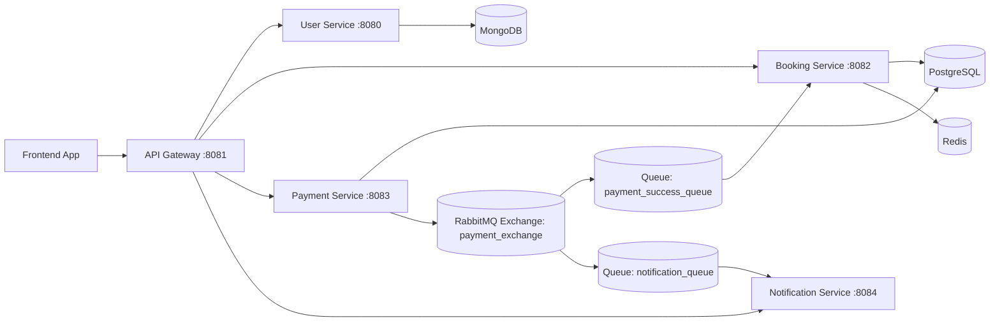

# NPCine Backend Architecture and Frontend Integration Guide

## Purpose
This document is the single source of truth for frontend integration with the NPCine backend.
It covers service boundaries, gateway routes, request/response contracts, authentication behavior,
booking and payment flow, asynchronous notifications, and operational guidelines.

## Integration Rule
Frontend clients must call only the API Gateway.
Do not call internal microservice ports directly from frontend code.

- Base URL: `http://localhost:8081`
- Auth mode: Bearer JWT in `Authorization` header
- Content type: `application/json`

## System Overview
NPCine follows a microservices architecture with an API Gateway and domain-specific services.
Services communicate over HTTP and RabbitMQ inside a Docker network.



## Runtime Components

### API Gateway
- Port: `8081`
- Responsibility:
  - Single entry point for frontend traffic
  - Route matching and forwarding
  - JWT gatekeeping for protected routes

### User Service
- Port: `8080`
- Database: MongoDB
- Responsibility:
  - Register users
  - Authenticate users
  - Issue JWT

### Booking Service
- Port: `8082`
- Database: PostgreSQL
- Cache/lock layer: Redis
- Responsibility:
  - Seat inventory APIs
  - Seat locking and booking lifecycle
  - Confirm bookings after payment success events

### Payment Service
- Port: `8083`
- Database: PostgreSQL
- Responsibility:
  - Create payment order records
  - Verify payment completion
  - Publish payment success event to RabbitMQ

### Notification Service
- Port: `8084`
- Dependency: RabbitMQ + SMTP
- Responsibility:
  - Consume payment success events
  - Send booking confirmation emails

## Gateway Route Map (Frontend-facing)

All routes below are called via `http://localhost:8081`.

### User/Auth routes
- `POST /auth/register` -> user-service
- `POST /auth/login` -> user-service
- `POST /login` -> rewritten to `/auth/login` (compatibility route)
- `POST /register` -> rewritten to `/auth/register` (compatibility route)

### Booking routes
- `GET /catalog/**` -> booking-service
- `POST /admin/**` -> booking-service
- `POST /bookings/**` -> booking-service

### Payment routes
- `POST /payments/**` -> payment-service
- `GET /payments/health` -> payment-service

### Notification/testing routes
- `GET /test-email` -> notification-service
- `/notifications/**` -> notification-service

## Authentication and Security Contract

### JWT acquisition
1. Call `POST /auth/login` with email/password.
2. Backend returns JWT.
3. Store token securely on frontend.

### JWT usage
Attach this header on protected endpoints:

`Authorization: Bearer <jwt-token>`

### Public endpoints
- `POST /auth/register`
- `POST /auth/login`
- `GET /catalog/...`
- service health endpoints (`/actuator/**` or `.../health`) as configured

### Protected endpoints
- booking mutation endpoints (`/bookings/**`, `/admin/**`)
- payment endpoints (`/payments/create`, `/payments/verify`)

## Domain Flows

## 1. User Registration
1. Frontend posts registration payload.
2. User service validates input and uniqueness.
3. User is created and JWT is returned.

## 2. User Login
1. Frontend posts email/password.
2. User service validates credentials.
3. JWT is returned.

## 3. Seat Discovery and Lock
1. Frontend requests available seats for a show.
2. User selects seats.
3. Frontend calls `POST /bookings/lock-seats` with JWT.
4. Booking service:
   - verifies seat availability in DB,
   - places distributed locks in Redis,
   - persists booking rows as `LOCKED` with expiry,
   - returns `bookingIds` to frontend.

## 4. Payment Create and Verify
1. Frontend calls `POST /payments/create` with `bookingIds` and amount.
2. Payment service creates payment order record and returns `razorpayOrderId`.
3. Frontend completes payment UI flow.
4. Frontend calls `POST /payments/verify` with order/payment IDs and booking IDs.
5. Payment service marks payment successful and publishes event:
   - `bookingIds`
   - `paymentId`
   - `userEmail`
   - `status=SUCCESS`

## 5. Async Post-Payment Processing
- Booking service consumer:
  - receives payment success event,
  - marks bookings `CONFIRMED`,
  - transitions seats to `BOOKED`,
  - releases Redis locks.
- Notification service consumer:
  - receives same event,
  - sends confirmation email to `userEmail`.

## Request/Response Contracts (Frontend-critical)

### `POST /auth/register`
Request:
```json
{
  "name": "Test User",
  "email": "test@example.com",
  "password": "Test@1234"
}
```
Response:
- `201 Created` with auth payload/token

### `POST /auth/login`
Request:
```json
{
  "email": "test@example.com",
  "password": "Test@1234"
}
```
Response:
- `200 OK` with auth payload/token

### `POST /bookings/lock-seats`
Headers:
- `Authorization: Bearer <token>`
- optional `Idempotency-Key: <unique-key>`

Request:
```json
{
  "showTimeId": "SHOW-001",
  "seatNumbers": ["A1", "A2"]
}
```
Response:
```json
{
  "message": "Seats Locked Successfully",
  "bookingIds": ["<id1>", "<id2>"]
}
```

### `POST /payments/create`
Headers:
- `Authorization: Bearer <token>`

Request:
```json
{
  "bookingIds": ["<id1>", "<id2>"],
  "amount": 500
}
```
Response:
```json
{
  "razorpayOrderId": "order_xxx"
}
```

### `POST /payments/verify`
Headers:
- `Authorization: Bearer <token>`

Request:
```json
{
  "razorpayOrderId": "order_xxx",
  "razorpayPaymentId": "pay_xxx",
  "bookingIds": ["<id1>", "<id2>"]
}
```
Success response:
```json
{
  "status": "Payment Successful",
  "confirmedBookings": ["<id1>", "<id2>"]
}
```

## Idempotency Guidance
- Supported on booking lock/confirm via `Idempotency-Key`.
- Frontend should generate a unique key per user action.
- Retry with same key for network failures to avoid duplicate operations.

## Error Model and Frontend Handling

Common status codes:
- `200` success
- `201` created
- `400` invalid payload or missing required fields
- `401` missing/invalid token
- `404` route not found
- `409` seat conflict or state conflict
- `500` unexpected server error

Typical Spring error body:
```json
{
  "timestamp": "2026-04-16T08:27:49.705Z",
  "status": 404,
  "error": "Not Found",
  "path": "/auth/login"
}
```

Frontend recommendations:
- Map `401` to forced re-login.
- Map `409` to seat selection refresh with user-friendly message.
- Show retry UI for `5xx` and network errors.

## Local Development and Verification

### Startup
From repo root:
```bash
docker compose up -d --build
```

### Essential checks
- Gateway: `http://localhost:8081`
- RabbitMQ dashboard: `http://localhost:15672` (`guest`/`guest`)

### Smoke flow checklist
1. Register/login
2. Get catalog seats
3. Lock seats
4. Create payment order
5. Verify payment
6. Re-fetch seats and confirm `BOOKED`

## Frontend Implementation Checklist
- Use one API client with `baseURL = http://localhost:8081`.
- Add request interceptor for JWT header.
- Add response interceptor for `401` and centralized error mapping.
- Use strict typing for booking/payment DTOs.
- Persist booking IDs between lock and payment steps.
- Handle async consistency: seat status can update shortly after payment verify.

## Environment and Config Notes
- Gateway routing keys use `spring.cloud.gateway.server.webmvc.routes`.
- JWT secret must remain aligned across gateway, user, booking, and payment services.
- In Docker, inter-service hosts use container names, not `localhost`.
- Notification service RabbitMQ host is environment-driven and defaults to `rabbitmq_broker`.

## Change Management
Whenever backend updates endpoint shape, status codes, or required headers:
- update this document,
- update Postman collection,
- update frontend API contract types in the same change cycle.
