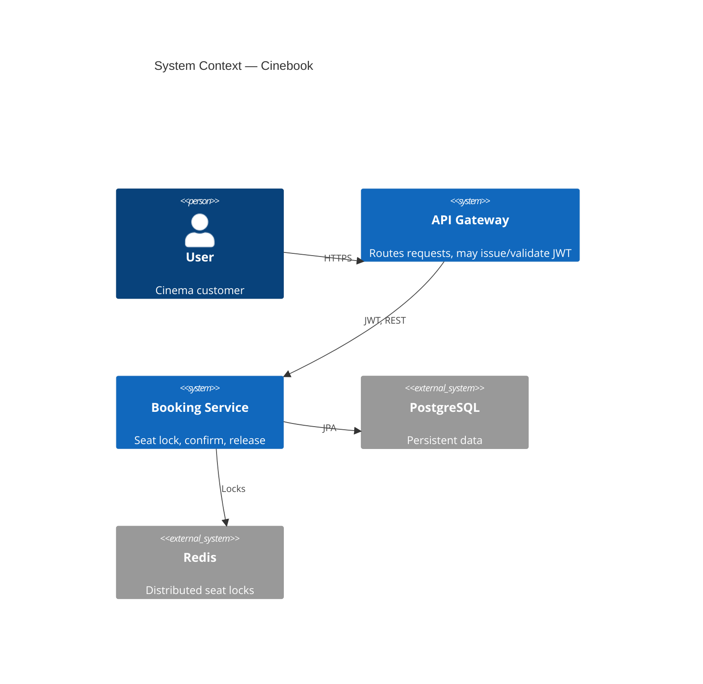
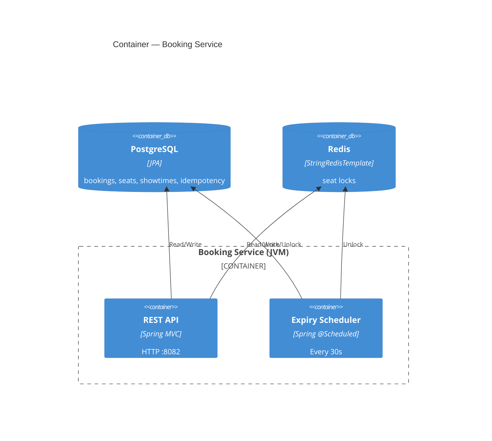
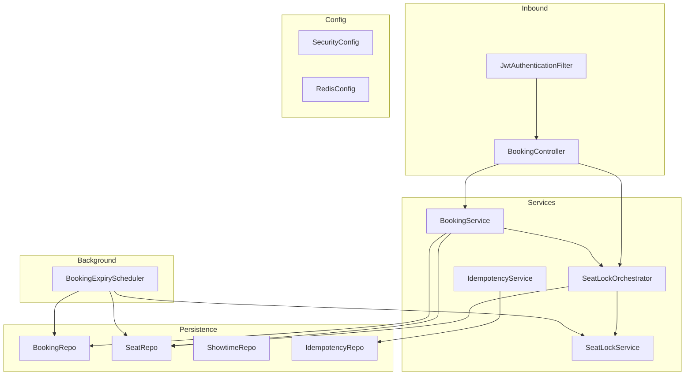
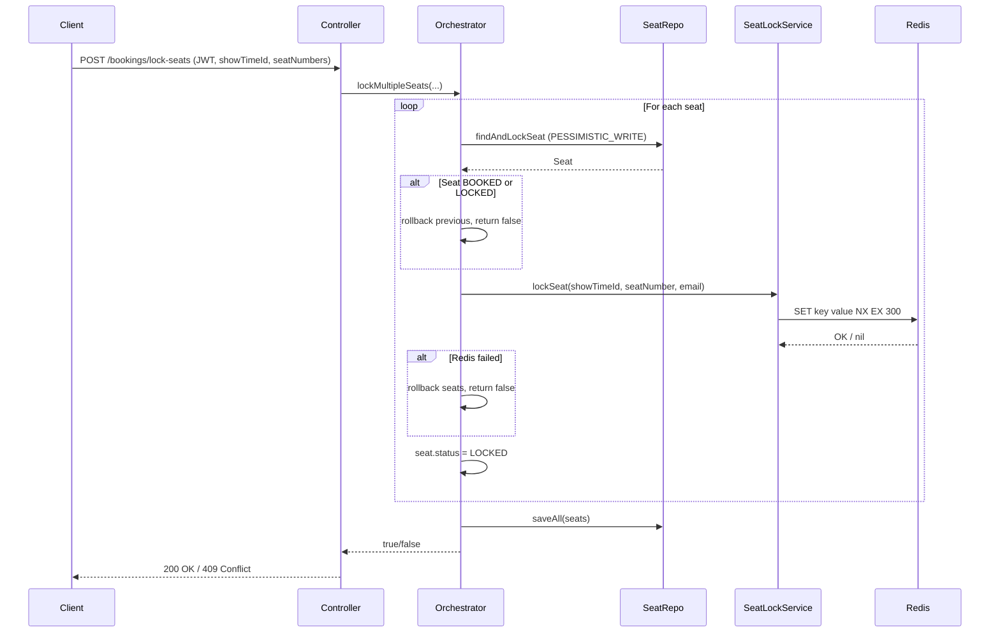
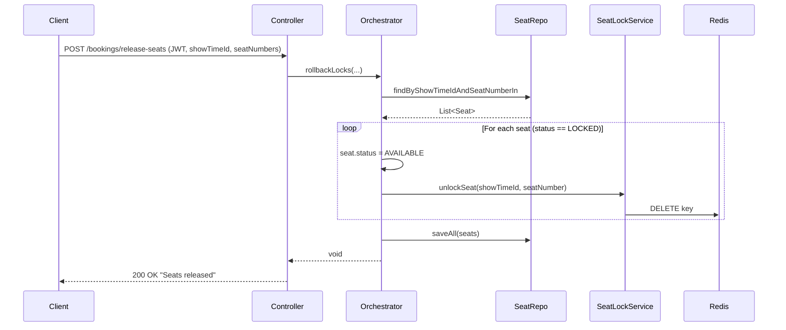
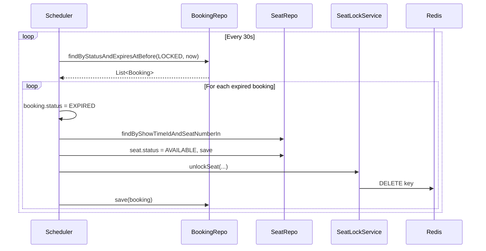
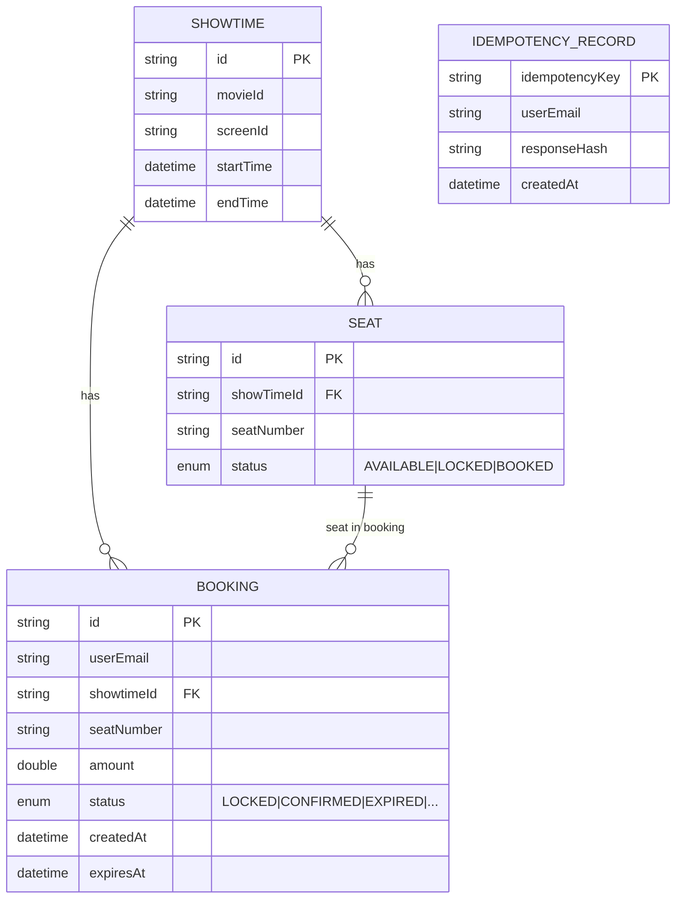
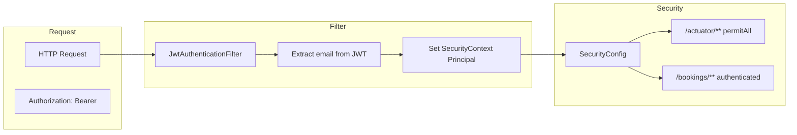
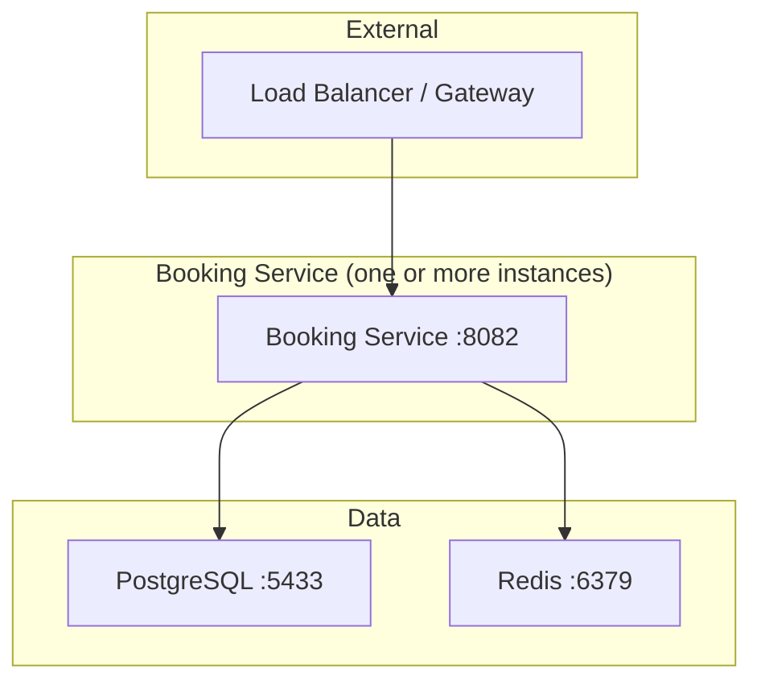

# Booking Service — Architecture

This document describes the architecture of **booking-service**, the cinema seat-booking backend for Cinebook.

---

## 1. System Context

The service sits inside the Cinebook ecosystem: clients talk via an API gateway; the gateway (or user-service) issues JWTs. Booking-service is responsible only for seat locking, confirmation, and release.



| Element | Description |
|---------|-------------|
| **User** | End user (browser/app) booking cinema seats. |
| **API Gateway** | Entry point; forwards requests to booking-service with JWT. |
| **Booking Service** | This application (port 8082). |
| **PostgreSQL** | Source of truth for bookings, seats, showtimes, idempotency. |
| **Redis** | Short-lived seat locks; shared across service instances. |

---

## 2. Container View (Booking Service)

Single deployable Spring Boot application. No internal “containers”; the box below is the process boundary.



---

## 3. Component View

Internal structure of the booking service (layers and main classes).



### Layer summary

| Layer | Components | Responsibility |
|-------|------------|----------------|
| **Inbound** | `JwtAuthenticationFilter`, `BookingController` | Parse JWT, set Principal; expose REST endpoints. |
| **Service** | `SeatLockOrchestrator`, `BookingService`, `SeatLockService`, `IdempotencyService` | Lock/confirm/release logic; Redis locks; idempotency (not yet wired). |
| **Persistence** | `BookingRepo`, `SeatRepo`, `ShowtimeRepo`, `IdempotencyRepo` | JPA access to PostgreSQL. |
| **Background** | `BookingExpiryScheduler` | Expire LOCKED bookings and free seats/locks. |
| **Config** | `SecurityConfig`, `RedisConfig` | Security chain, Redis template. |

---

## 4. Request Flows

### 4.1 Lock seats

User locks one or more seats for a show. Each seat is pessimistically locked in the DB, then a Redis key is set (5 min TTL), then `Seat.status` is set to LOCKED.



### 4.2 Confirm booking

User confirms previously locked seats. Service validates seats are LOCKED, creates CONFIRMED booking rows, sets seats to BOOKED, then releases Redis locks.

```mermaid
sequenceDiagram
    participant Client
    participant Controller
    participant BookingService
    participant SeatRepo
    participant BookingRepo
    participant Orchestrator
    participant Redis

    Client->>Controller: POST /bookings/confirm (JWT, showTimeId, seatNumbers)
    Controller->>BookingService: confirmBooking(...)

    BookingService->>SeatRepo: findByShowTimeIdAndSeatNumberIn
    SeatRepo-->>BookingService: List<Seat>

    loop For each seat
        alt Seat not LOCKED
            BookingService-->>Controller: throw RuntimeException
        end
        BookingService->>BookingService: seat.status = BOOKED
        BookingService->>BookingRepo: save(Booking CONFIRMED)
    end
    BookingService->>SeatRepo: saveAll(seats)
    BookingService->>Orchestrator: rollbackLocks(showTimeId, seatNumbers, email)
    Orchestrator->>SeatRepo: findByShowTimeIdAndSeatNumberIn
    Orchestrator->>Redis: DELETE seat:lock:...
    Orchestrator->>SeatRepo: saveAll (already BOOKED here; unlock only)
    BookingService-->>Controller: List<Booking>
    Controller-->>Client: 200 OK (bookings) / 409 Conflict
```

### 4.3 Release seats

User voluntarily releases locked seats. DB seats are set back to AVAILABLE and Redis keys removed.



### 4.4 Expiry scheduler

Runs every 30 seconds; finds LOCKED bookings with `expiresAt < now`, marks them EXPIRED, frees the seat and Redis lock. (Note: currently no LOCKED booking rows are created by the API; see SERVICE_OVERVIEW.md.)



---

## 5. Data Model & Storage

### 5.1 Entity relationship (conceptual)



- **Showtime**: One per movie/screen/slot. Referenced by `showTimeId` in Seat and Booking.
- **Seat**: One row per physical seat per showtime; `status` is source of truth for AVAILABLE / LOCKED / BOOKED.
- **Booking**: One row per confirmed (or, if wired, locked) reservation; links user, showtime, seat, amount, status.
- **IdempotencyRecord**: For idempotent confirm/lock (not yet used in API).

### 5.2 Redis key layout

| Key pattern | Value | TTL | Purpose |
|------------|--------|-----|---------|
| `seat:lock:{showTimeId}:{seatNumber}` | `userEmail` | 5 min | Distributed lock; only one holder per seat. |

No other keys are used. TTL ensures abandoned locks are released even if the scheduler does not run.

---

## 6. Security Architecture



| Aspect | Implementation |
|--------|----------------|
| **Authentication** | Stateless JWT only. No session; no form login or HTTP Basic. |
| **Filter** | `JwtAuthenticationFilter`: reads `Authorization: Bearer <token>`, validates with `JwtUtil`, sets `Principal` = email. |
| **Authorization** | `/actuator/**` permitted; `/bookings/**` requires authenticated user. |
| **Identity in app** | `Principal.getName()` in controllers = user email from JWT. |

---

## 7. Deployment View

Single service instance (or multiple behind a load balancer). Each instance needs its own JVM, and shared PostgreSQL and Redis.



- **Port**: 8082 (configurable via `server.port`).
- **Scaling**: Horizontal scaling is safe for the booking API because seat locks are in Redis (shared). DB uses pessimistic locking for consistency.
- **Config**: `application.yml` (and profiles) for server, datasource, Redis, JWT. Production should use env or secret manager for credentials.

---

## 8. Technology Stack (Summary)

| Concern | Technology |
|---------|------------|
| Runtime | Java 21 |
| Framework | Spring Boot 4.0.3 |
| Build | Maven |
| HTTP | Spring Web MVC |
| Security | Spring Security, JJWT 0.11.5 |
| Persistence | Spring Data JPA, PostgreSQL |
| Caching / locks | Spring Data Redis, Redis |
| Scheduling | Spring `@Scheduled` |
| Validation | Spring Validation (Bean Validation) |

---

## 9. Related Documents

- **SERVICE_OVERVIEW.md** — What the service does, current gaps, and production-grade improvement ideas.
- **README** — How to run the service (if present).
